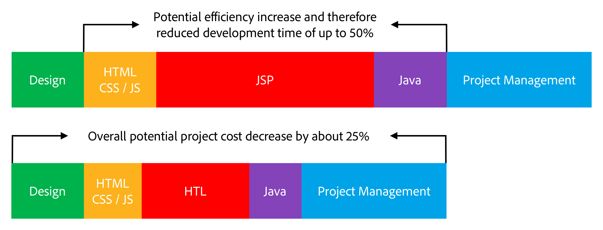

# Overzicht {#overview}

>[!TIP]
>
>**hebt u Edge Delivery Services voor AEM overwogen?**
>
>U kunt de methoden die in dit document worden beschreven, blijven gebruiken voor bestaande projecten. Nochtans voor nieuwe projecten, adviseert Adobe leveraging [ Edge Delivery Services.](https://experienceleague.adobe.com/en/docs/experience-manager-cloud-service/content/edge-delivery/overview)

HTML Template Language (HTL), ondersteund door Adobe Experience Manager (AEM), is bedoeld om een zeer productief webframework op bedrijfsniveau te bieden dat de beveiliging verbetert. Ook kunnen HTML-ontwikkelaars zonder Java-kennis beter deelnemen aan AEM-projecten.

[ geïntroduceerd in AEM 6.0 ](history.md), is de Taal van het Malplaatje van HTML het aangewezen en geadviseerde server-zijmalplaatjesysteem voor HTML in AEM. Voor webontwikkelaars die robuuste bedrijfswebsites moeten maken, helpt de HTML Template Language om de efficiëntie van beveiliging en ontwikkeling te verhogen.

## Meer beveiliging {#increased-security}

De Taal van het Malplaatje van HTML (HTL) verbetert plaatsveiligheid door context-bewuste ontsnapt automatisch toe te passen op alle outputvariabelen, die het veiliger maken dan de meeste andere malplaatjesystemen. HTL maakt deze benadering mogelijk omdat het de syntaxis van HTML begrijpt, en die kennis gebruikt om het vereiste ontsnapt voor uitdrukkingen aan te passen, die op hun positie in de prijsverhoging worden gebaseerd. Deze methode kan ertoe leiden dat expressies die in `href` - of `src` -kenmerken zijn geplaatst, anders worden beschermd dan expressies die in andere kenmerken zijn geplaatst, of elders.

Hoewel hetzelfde resultaat kan worden bereikt met sjabloontalen zoals JSP, moet de ontwikkelaar er handmatig voor zorgen dat de juiste escape wordt toegepast op elke variabele. Aangezien één enkele omissie of fout in de toegepaste escape potentieel voldoende is om een XSS-kwetsbaarheid (cross-site scripting) te veroorzaken, besloot Adobe deze taak te automatiseren met HTML. Indien nodig, kunnen de ontwikkelaars nog een verschillende ontsnapt aan de uitdrukkingen specificeren, maar met HTML is het standaardgedrag veel waarschijnlijker om aan het gewenste gedrag te beantwoorden, die de waarschijnlijkheid van fouten verminderen.

## Vereenvoudigde ontwikkeling {#simplified-development}

De HTML-sjabloontaal is gemakkelijk te leren en de bijbehorende functies zijn doelbewust beperkt, zodat deze eenvoudig en rechtmatig blijft. Het heeft ook krachtige mechanismen om de prijsverhoging te structureren en logica aan te halen, terwijl het altijd strikte scheiding van zorgen tussen prijsverhoging en logica handhaaft. HTML is standaard HTML5, waarbij expressies en gegevenskenmerken worden gebruikt om de markering aan te vullen met dynamisch gedrag. Deze benadering handhaaft de geldigheid en de leesbaarheid van de prijsverhoging. De evaluatie van de expressies en gegevenskenmerken vindt volledig op de server plaats en is niet zichtbaar op de client-kant, waar elk gewenst JavaScript-framework kan worden gebruikt zonder dat dit interfereert.

Met deze functies kunnen HTML-ontwikkelaars zonder Java-kennis HTML-sjablonen bewerken, integreren in het ontwikkelingsteam en de samenwerking met Java-ontwikkelaars met volledige stapels stroomlijnen. En omgekeerd, laat het de ontwikkelaars van Java om zich op de achterste-eindcode te concentreren zonder zich over HTML ongerust te maken.

## Lagere kosten {#reduced-costs}

De verhoogde veiligheid, vereenvoudigde ontwikkeling, en betere teamsamenwerking, vertaalt voor de Projecten van AEM in verminderde inspanning, snellere tijd aan markt (TTM), en lagere totale kosten van eigendom (TCO).

Uit de herimplementatie van de Adobe.com-site met HTML Template Language is gebleken dat de projectkosten en -duur tot ongeveer 25% zijn teruggebracht.

Bovenstaand diagram laat de volgende verbeteringen zien in de efficiëntie die mogelijk door HTL mogelijk worden gemaakt:

* **HTML / CSS / JS:** de ontwikkelaars van HTML kunnen malplaatjes direct uitgeven HTML, toestaand front-end ontwerpen om rechtstreeks op de componenten van AEM worden uitgevoerd, eliminerend de behoefte aan afzonderlijke implementatie. Deze aanpak vermindert pijnlijke herhalingen met de full-stack Java-ontwikkelaars.
* **JSP/HTL:** omdat HTML zelf geen kennis van Java vereist en door:sturen om te schrijven, wordt om het even welke ontwikkelaar met de deskundigheid van HTML gemachtigd om de malplaatjes uit te geven.
* **Java:** dankzij duidelijk en eenvoudig om gebruik-API te gebruiken die door HTML wordt verstrekt, wordt de interface met de bedrijfslogica verduidelijkt, die ook de ontwikkeling van Java over het algemeen bevordert.

## Video-introductie {#video}

De volgende video van een [ zitting van AEM Gems ](https://experienceleague.adobe.com/en/docs/events/experience-manager-gems-recordings/gems2014/aem-introduction-to-htl), geeft een overzicht van het doel van HTML evenals implementatievoorbeelden.

>[!VIDEO](https://video.tv.adobe.com/v/19504/?quality=9)

Gelieve te merken op dat de video naar HTML door [ zijn vroegere naam, recht ](history.md) verwijst.

## Volgende stappen {#next-steps}

Nu je de doelstellingen en voordelen van HTML kent, kun je aan de slag met de taal. Zie [ Begonnen het Worden met de Taal van het Malplaatje van HTML ](getting-started.md).
